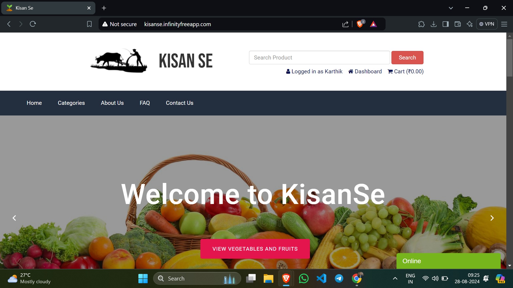
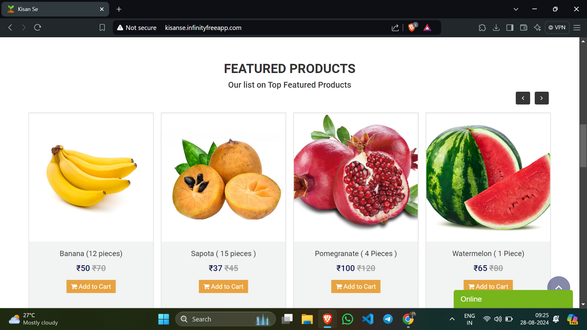
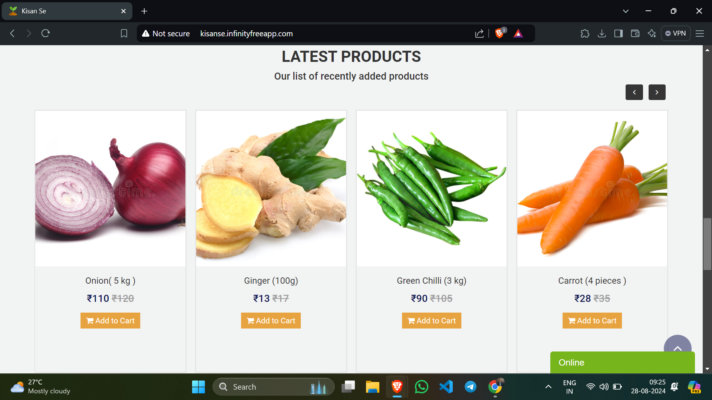
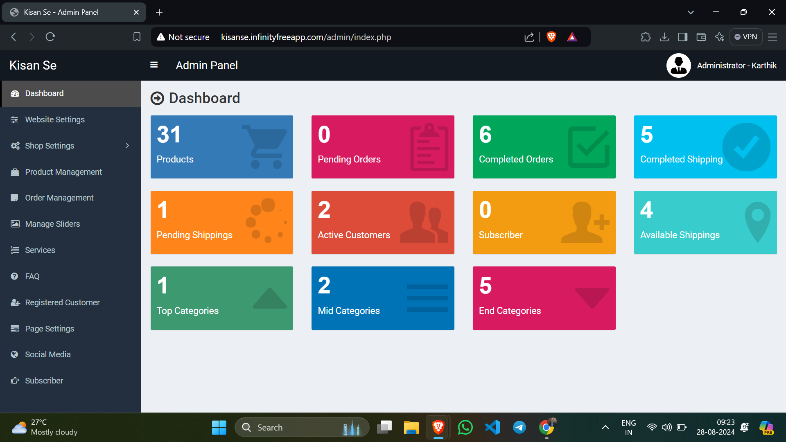
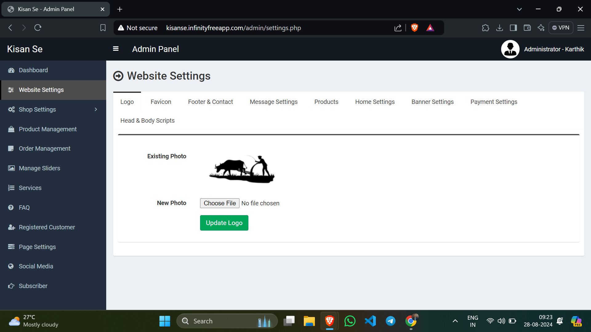
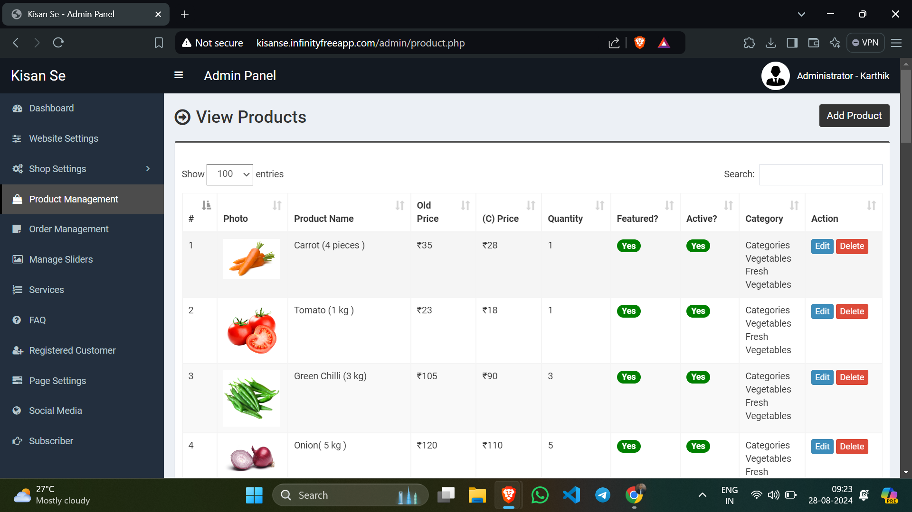
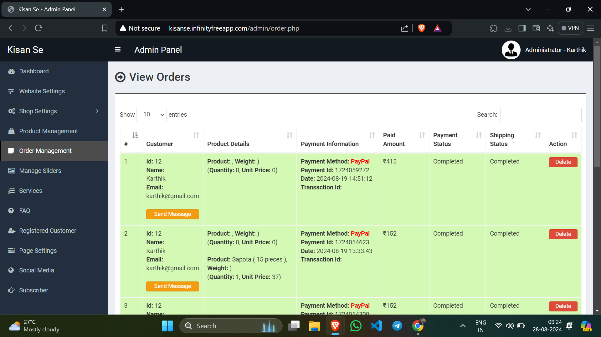

# 🌾 KisanSe

*KisanSe* is a web application designed to connect consumers directly with local farmers, promoting sustainable agriculture and healthy food choices. By eliminating intermediaries, the platform ensures fair prices for both consumers and farmers, fostering a transparent and equitable marketplace.

## 🚀 Features

- **🌱 Direct Farmer-to-Consumer Sales:** Enables over 50+ farmers to directly sell their produce, reducing costs for consumers and increasing profits for farmers.
- **🖥️ User-Friendly Interface:** Designed with HTML, CSS, and JavaScript for an intuitive and responsive user experience.
- **⚙️ Efficient Backend:** Built using PHP, ensuring faster page loads and higher user engagement.
- **💳 Secure Payment Integration:** Integrated PayPal and bank transfer payment processing, increasing checkout completion rates.
- **🛠️ Admin Dashboard:** Allows administrators to oversee and manage the platform, ensuring secure and transparent transactions.

## 🔍 Key Functionalities

1. **🛒 Customer Interface:**
   - Browse a variety of fresh produce and other farm products.
   - Place orders directly with farmers.
   - Communicate with farmers through the platform.

2. **🌾 Farmer Interface:**
   - List products for sale.
   - Manage orders and interact with customers.
   - Access resources and support to grow and scale their business.

3. **🕹️ Admin Interface:**
   - Dashboard for managing users, products, and orders.
   - Monitor transactions and ensure compliance with platform policies.
   - Handle payment processing and logistics.

## 🔧 How It Works

- **🔍 Browse Products:** Customers can explore a wide range of fresh produce and other farm goods listed by local farmers.
- **📦 Place Orders:** Orders can be placed directly through the platform, with options for home delivery.
- **💰 Payment Processing:** All payments are handled securely through integrated payment gateways (PayPal and bank transfer).
- **🚚 Delivery:** The platform manages logistics, ensuring a seamless experience from purchase to delivery.

## 🛠️ Technologies Used

- **Frontend:** HTML, CSS, JavaScript
- **Backend:** PHP
- **Payment Integration:** PayPal
- **Hosting:** InfinityFree

## 📸 Screenshots

1. **📊 KisanSe**
   - 
     
   - 
     
   - 

2. **🛠️ Admin Panel Dashboard**
   - 
     
   - 
     
   - 
     
   - 

## 🔗 Project Demo

- **Hosted on:** [InfinityFree](https://www.infinityfree.com/)
- **Demo Link:** [KisanSe](http://kisanse.infinityfreeapp.com/)

## 🎯 Mission

KisanSe is committed to promoting sustainable agriculture and empowering local communities by enabling consumers to make healthy food choices. We believe in creating a fair and transparent marketplace that benefits both customers and farmers.

## 🤝 Contribution

Contributions are welcome! If you would like to contribute to the project, please fork the repository and submit a pull request.

## 📬 Contact

If you have any questions or feedback, please don't hesitate to contact us.

*Thank you for supporting sustainable farming!*
